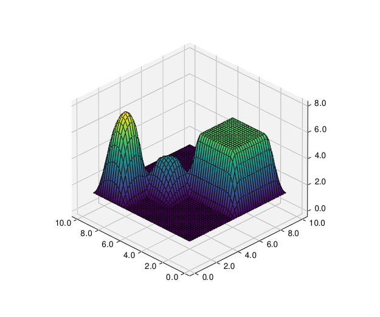
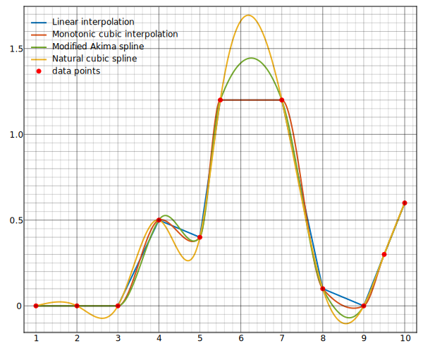

# cubinterpp

Cubic and linear interpolation with C++ in Python.



## Introduction

This C++ header library features tools for piecewise linear and cubic
interpolation.

For cubic piecewise interpolation, the library features three types:

- Monotone cubic interpolation
- Akima spline interpolation 
- Natural cubic spline interpolation

Linear interpolation is supported for `N`-dimensional data, whereas cubic
interpolation currently only supports `1`- and `2`-dimensional data. Cubic
piecewise interpolation for `N`-dimensional data is planned.

All classes are templatized and support the STL's vector types.

The accompanying python script in [cubinterpp ](cubinterpp ) compares the
interpolation types.

## Data requirements

`cubinterpp` is designed to only handle rectangular grid data with strictly
ascending coordinates. To this end, coordinate data is only required in one
dimensional form for each coordinate direction. Only the actual data itself
needs to be supplied in the actual dimensions. The user is responsible to assure
that the supplied data size of each dimension fits to the coordinate data.

## Usage

The following instructions show how to build and test the cubinterpp header
library in a python environment.

### Prerequisites

- C++ compiler, e.g. [gcc](https://gcc.gnu.org/)
- [cmake](https://cmake.org/): to use the provided cmake configuration
- [pybind11](https://github.com/pybind/pybind11): to compile the library header
  into a python module
- [mlpyqtgraph](https://github.com/swvanbuuren/mlpyqtgraph): to plot the
  example's results

### Building

To build the header library for usage in Python, it's recommended to use
[cmake](https://cmake.org/). An appropriate cmake configuration is provided in
the main [`CMakeLists.txt`](CMakeLists.txt). Prior to compilation, the required
external libraries are downloaded automatically using the cmake FetchContent
module. Prior to building, make sure `cmake` is installed and configured with a
C++ compiler like e.g. [gcc](https://gcc.gnu.org/). In order to create the
python module, the development python library is also required.

In order to do so on a Debian based system, install `cmake`, `gcc`, `g++` and
`python3.11-dev` (change the python version depending on your configuration):

```bash
sudo apt install cmake gcc g++ python3.11-dev
```

Set the appropriate environment variables (it's recommended to add these lines
to e.g. your `.bashrc`):

```bash
export CC=/usr/bin/gcc
export CXX=/usr/bin/g++
```

Then create the build directory, configure and build using:

```bash
mkdir build
cmake ..
make
```

This should build and automatically copy the library file `cubic_spline.*.so`
into the `cubinterpp` directory.

### Testing

This library comes with severals [tests](tests). To run all tests, first build
and then run (while remaining in the `build` directory):

```bash
ctest -V
```

### Interpolating and plotting the results

A [python program](cubinterpp/main.py) is provided to compare the three
interpolation types. Data preparation and visualization is done in python with
[mlpyqtgraph](https://github.com/swvanbuuren/mlpyqtgraph).

In order to run the python program, it's recommended to [install
uv](https://docs.astral.sh/uv/getting-started/installation/#standalone-installer)
and issue:

```bash
uv run cubinterpp 
```

This should install all required python dependencies automatically and run the
python program that does the interpolation and plotting, resulting in the
comparison plot shown at the top of this document.

### Higher interpolation dimensions

By default, the library offers linear interpolation classes up to three
dimensions with `std::vector` input types. If you'd like to implement higher
dimensions, it's recommended to inherit from the `N-dimensional` interpolation
class for a given dimension. For example, for three dimensional linear
interpolation this could look like:

```cpp
#include "linear_interp.hpp"

template <typename T>
class LinearInterp3D : public LinearInterpND<T, 3> {
    using Vector = std::vector<T>;
    using Vector3 = cip::VectorN<T, 3>;
public:
    explicit LinearInterp3D(const Vector &x, const Vector &y, const Vector &z, const Vector3 &f)
    : LinearInterpND<T, 3>(f, x, y, z)
    {}

    ~LinearInterp3D() { }
};
```

Note the counter-intuitive order of the constructor argument in
`LinearInterpND`, due to the requirement that a parameter pack always needs to
come last. This can be corrected in the inheriting classes constructor. Here,
it's also possible to use different input types, which might differ per
application.

## License

An MIT style license applies for cubinterpp, see the [LICENSE](LICENSE) file for
more details.
