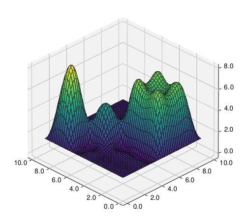

# cubinterpp

`N`-dimensional cubic and linear interpolation in modern C++ with Python
support.

|  |
|:--:|
| *1D interpolation* |

|  |   | 
|:--:|:--:| 
| *2D Linear interpolation* | *2D Monotonic cubic spline interpolation* |

|  |   | 
|:--:|:--:| 
| *2D Akima spline interpolation* | *2D Natural spline interpolation* |


## Introduction

This C++ header library features tools for piecewise linear and cubic
interpolation in `N` dimensions.

For cubic piecewise interpolation, the library features three types:

- Monotone cubic interpolation
- Akima spline interpolation 
- Natural cubic spline interpolation

All classes are templatized and support the STL's vector types.

The accompanying python script in [cubinterpp ](cubinterpp ) compares the
interpolation types.

Refer to the [documentation](https://swvanbuuren.github.io/cubinterpp/) for:

- [Requirements](https://swvanbuuren.github.io/cubinterpp/requirements/)
- [Usage instructions](https://swvanbuuren.github.io/cubinterpp/usage/)
  - [Single header file](https://swvanbuuren.github.io/cubinterpp/usage#single-header-library)
  - [Build from source](https://swvanbuuren.github.io/cubinterpp/usage#build-from-source)
- [Mathematical background](https://swvanbuuren.github.io/cubinterpp/theory/)
- [Code reference](https://swvanbuuren.github.io/cubinterpp/reference/)

## Pre-commit hooks

This repository comes with pre-commit hooks. To enable the hooks issue:

```bash
uv run pre-commit install --install-hooks
```

## License

An MIT style license applies for cubinterpp, see the [LICENSE](LICENSE) file for
more details.
