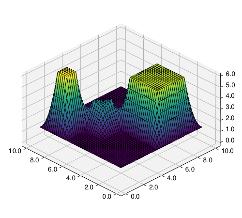
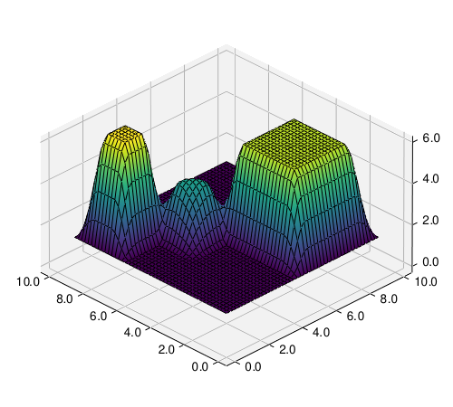
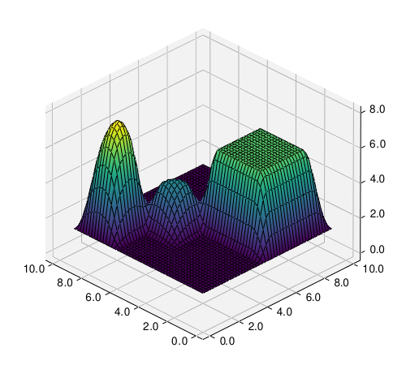

# cubinterpp

`N`-dimensional cubic and linear interpolation in modern C++ with Python
support.

|  |
|:--:|
| *1D interpolation* |

|  |   | 
|:--:|:--:| 
| *2D Linear interpolation* | *2D Monotonic cubic spline interpolation* |

|  |   | 
|:--:|:--:| 
| *2D Akima spline interpolation* | *2D Natural spline interpolation* |


## Introduction

This C++ header library features tools for piecewise linear and cubic
interpolation in `N` dimensions.

For cubic piecewise interpolation, the library features three types:

- Monotone cubic interpolation
- Akima spline interpolation 
- Natural cubic spline interpolation

All classes are templatized and support the STL's vector types.

The accompanying python script in [cubinterpp ](cubinterpp ) compares the
interpolation types.

Refer to the [documentation](https://swvanbuuren.github.io/cubinterpp/) for:

- [Requirements](https://swvanbuuren.github.io/cubinterpp/requirements/)
- [Usage instructions](https://swvanbuuren.github.io/cubinterpp/usage/)
- [Mathematical background](https://swvanbuuren.github.io/cubinterpp/theory/)
- [Code reference](https://swvanbuuren.github.io/cubinterpp/reference/)

### Building

To build the header library for usage in Python, it's recommended to use
[cmake](https://cmake.org/). An appropriate cmake configuration is provided in
the main [`CMakeLists.txt`](CMakeLists.txt). Prior to compilation, the required
external libraries are downloaded automatically using the cmake FetchContent
module. Prior to building, make sure `cmake` is installed and configured with a
C++ compiler like e.g. [gcc](https://gcc.gnu.org/). In order to create the
python module, the development python library is also required.

In order to do so on a Debian based system, install `cmake`, `gcc`, `g++` and
`python3.11-dev` (change the python version depending on your configuration):

```bash
sudo apt install cmake gcc g++ python3.11-dev
```

Set the appropriate environment variables (it's recommended to add these lines
to e.g. your `.bashrc`):

```bash
export CC=/usr/bin/gcc
export CXX=/usr/bin/g++
```

Then create and move into the build directory, configure cmake and build using:

```bash
mkdir build
cd build
cmake ..
make
```

This should build `cubinterpp` and automatically copy the library file
`cubic_spline.*.so` into the `cubinterpp` directory.

### Testing

This library comes with severals [tests](tests). To run all tests, first build
and then run (while remaining in the `build` directory):

```bash
ctest -V
```

### Interpolating and plotting the results

A [python program](cubinterpp/main.py) is provided to compare the three
interpolation types. Data preparation and visualization is done in python with
[mlpyqtgraph](https://github.com/swvanbuuren/mlpyqtgraph).

In order to run the python program, it's recommended to [install
uv](https://docs.astral.sh/uv/getting-started/installation/#standalone-installer)
and issue:

```bash
uv run cubinterpp 
```

This should install all required python dependencies automatically and run the
python program that does the interpolation and plotting, resulting in the
comparison plot shown at the top of this document.

### Further reading

Check out the [usage
instructions](https://swvanbuuren.github.io/cubinterpp/usage/) in the
[documentation](https://swvanbuuren.github.io/cubinterpp/) for more details and
examples.

## License

An MIT style license applies for cubinterpp, see the [LICENSE](LICENSE) file for
more details.
