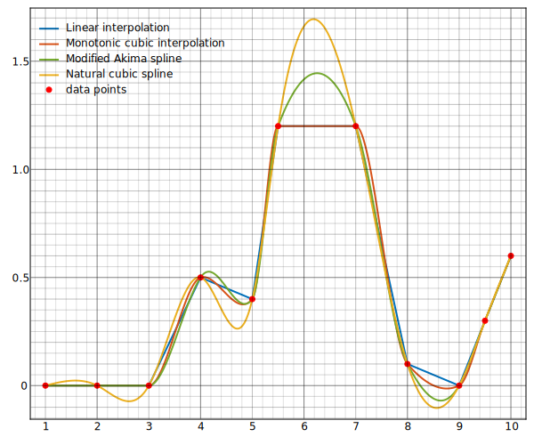
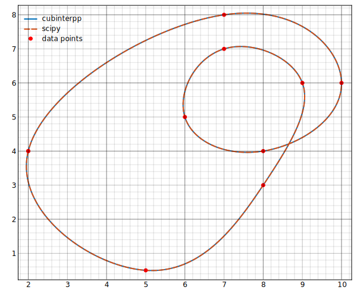
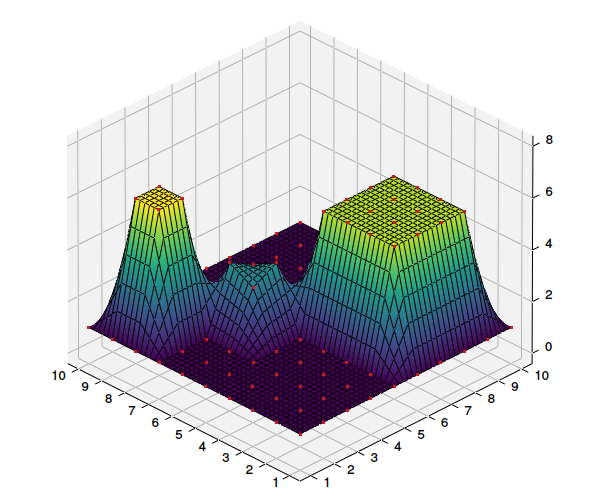
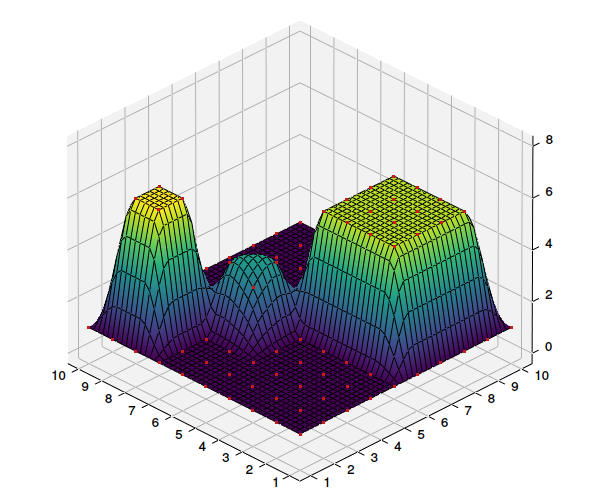
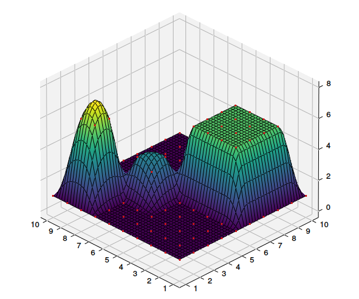
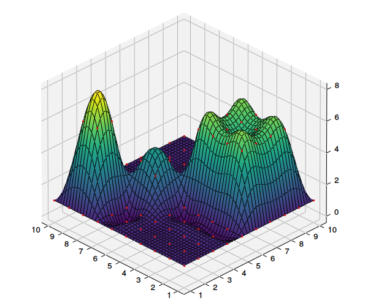
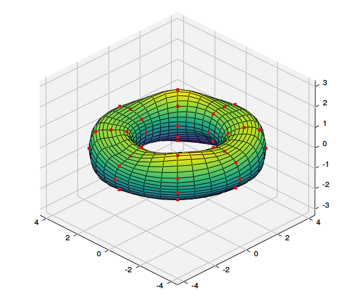

# Examples

This page showcases cubinterpp interpolation examples in one and two dimensions, covering
different slope estimation methods and boundary conditions.

## 1 Dimension

The first example, available in [`main.py`](https://github.com/swvanbuuren/cubinterpp/tree/master/cubinterpp/main.py),
compares linear interpolation against several cubic spline variants side by side, illustrating
how the choice of slope estimation method affects the smoothness and accuracy of the result.

{ width="600" }
/// caption
Comparison of 1D interpolation types
///

The second example demonstrates periodic boundary conditions applied to a parametric curve.
The source code in [`periodic_spline.py`](https://github.com/swvanbuuren/cubinterpp/tree/master/cubinterpp/periodic_spline.py)
shows how to configure a spline that smoothly closes on itself, making it well suited for
cyclically repeating data.

{ width="600" }
/// caption
Parametric curve with periodic boundary conditions
///

## 2 Dimensions

The following examples extend interpolation to two dimensions. Each plot shows the
interpolated surface together with the input data points (red dots), making it easy to see
how different methods handle the data. The full source is available in
[`main_2d.py`](https://github.com/swvanbuuren/cubinterpp/tree/master/cubinterpp/main_2d.py).

/// caption
Linear interpolation
///

/// caption
Monotonic spline interpolation
///

/// caption
2D Modified Akima spline interpolation
///

/// caption
2D Natural spline interpolation
///

The final example applies periodic boundary conditions to a 2D parametric surface, producing
a smooth, seamlessly tiling result. The corresponding source code can be found in
[`periodic_spline_2d.py`](https://github.com/swvanbuuren/cubinterpp/tree/master/cubinterpp/periodic_spline_2d.py).

/// caption
2D parametric periodic spline
///