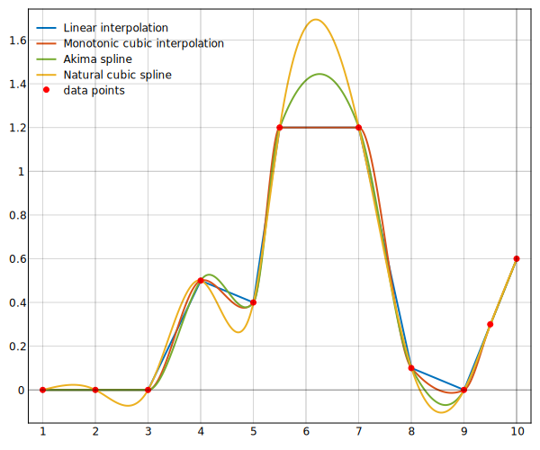

# Introduction

This C++ header library features tools for piecewise linear and cubic
interpolation.

For cubic piecewise interpolation, the library features three types:

- Monotone cubic interpolation
- Akima spline interpolation 
- Natural cubic spline interpolation

Linear interpolation is supported for `N`-dimensional data, whereas cubic
interpolation currently only supports `1`- and `2`-dimensional data. Cubic
piecewise interpolation for `N`-dimensional data is planned.

All classes are templatized and support the STL's vector types.

The accompanying python script `main.py` in [cubinterpp
](https://github.com/swvanbuuren/cubinterpp/tree/master/cubinterpp) compares the
interpolation types.

The following figure features a comparison of 1D interpolation types that are supported by cubinterpp.

